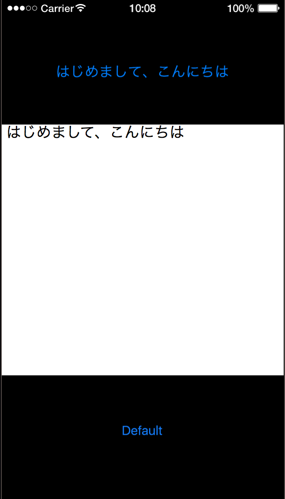

## テキストボックスSample

便利系Sampleの「テキストボックスを生成する」利用したSampleです。

画面下部に表示されているボタンを押すと、テキストボックスに入力した内容がテキストボックスの上に表示される、というものです。

``` lua

-----------------------------------------------------------------------------------------
--テキストボックスsample

-- main.lua
--
-----------------------------------------------------------------------------------------

--　画面の横幅(1080)を取得し、変数”width”に入れる
width = display.contentWidth

--　画面の縦幅(1920)を取得し、変数"height"に入れる
height = display.contentHeight

-- 描画グループを作る
displayGroup = display.newGroup()

-- テキストボックスに表示されている文字を入れる変数を宣言
editText = ""

-- テキストを表示する関数
local function textView()
local text = display.newText(editText, width/2, height/7, native.systemFont, 60)
text:setFillColor(0, 0.5, 1)

end

-- テキストボックスに入力した文字を表示するボタンを作る
local widget = require( "widget" )

local function handleButtonEvent( event )

    if( "ended" == event.phase ) then
        textView()

    end
end

-- ボタンの設定
local textButton = widget.newButton(
    {
        left = 450,
        top = 1620,
        fontSize = 50,
        id = "button1",
        label = "Default",
        onEvent = handleButtonEvent

    }
) 


-- テキストボックスのevent時の設定関数を作る
function textListener(event)

    -- 編集を始める時
    if( event.phase == "began" ) then

    -- 終わったもしくは投稿したとき
    elseif( event.phase == "ended" or event.phase == "submitted" ) then
        print( event.target.text )
        editText = event.target.text
        print(editText)

    -- 編集中
    elseif( event.phase == "editing" ) then
        print( event.newCharacters )
        --print( event.startPosition )
        print( event.text )

    end
end

-- テキストボックスを生成( x, y, 横の大きさ, 縦の大きさ )
textBox = native.newTextBox( 540, 960, width, height/2 )

-- 編集できるように設定
textBox.isEditable = true
textBox:addEventListener( "userInput", textListener )

```


ボタンを押した後の画面はこのようになります。




