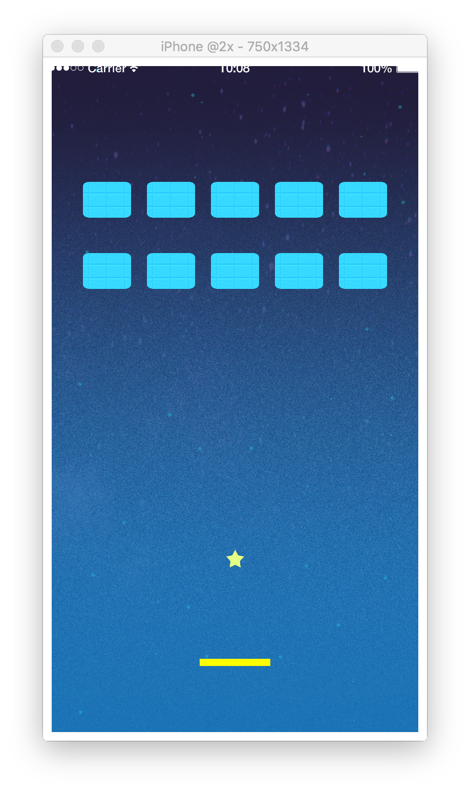

# 9. ゲーム判定を追加しよう

## 変数と関数を準備しよう
ゲームのクリアとゲームオーバー判定の状態を `completeText` という変数を使ってテキストで表示しようと思います。  
最初は何も表示したくないので、最初は `completeText` に `nil(空)` を入れておきましょう。  
`completeGame` や `failGame` が呼ばれたタイミングで生成するようにしましょう。

```lua
completeText = nil

function completeGame()
    physics.pause()
    completeText = display.newText(displayGroup, "Complete", width/2, height/2, native.systemFont, 100)
    completeText:setTextColor(1.0, 1.0, 1.0)

    -- Runtime:addEventListener("tap", resetGame)
end

function failGame()
    physics.pause()
    completeText = display.newText(displayGroup, "Fail", width/2, height/2, native.systemFont, 100)
    completeText:setTextColor(1.0, 1.0, 1.0)

    -- Runtime:addEventListener("tap", resetGame)
end
```

参考
CoronaSDK Reference[newText]

[https://docs.coronalabs.com/api/library/display/newText](https://docs.coronalabs.com/api/library/display/newText.html)

---

## セクション中の全文
このセクションで書いたコードの全文は以下になります。

```lua
completeText = nil

function completeGame()
    physics.pause()
    completeText = display.newText(displayGroup, "Complete", width/2, height/2, native.systemFont, 100)
    completeText:setTextColor(1.0, 1.0, 1.0)

    -- Runtime:addEventListener("tap", resetGame)
end

function failGame()
    physics.pause()
    completeText = display.newText(displayGroup, "Fail", width/2, height/2, native.systemFont, 100)
    completeText:setTextColor(1.0, 1.0, 1.0)

    -- Runtime:addEventListener("tap", resetGame)
end
```

画面は以下のようになっていれば成功です。  
前のセクションと同じ画面です。


