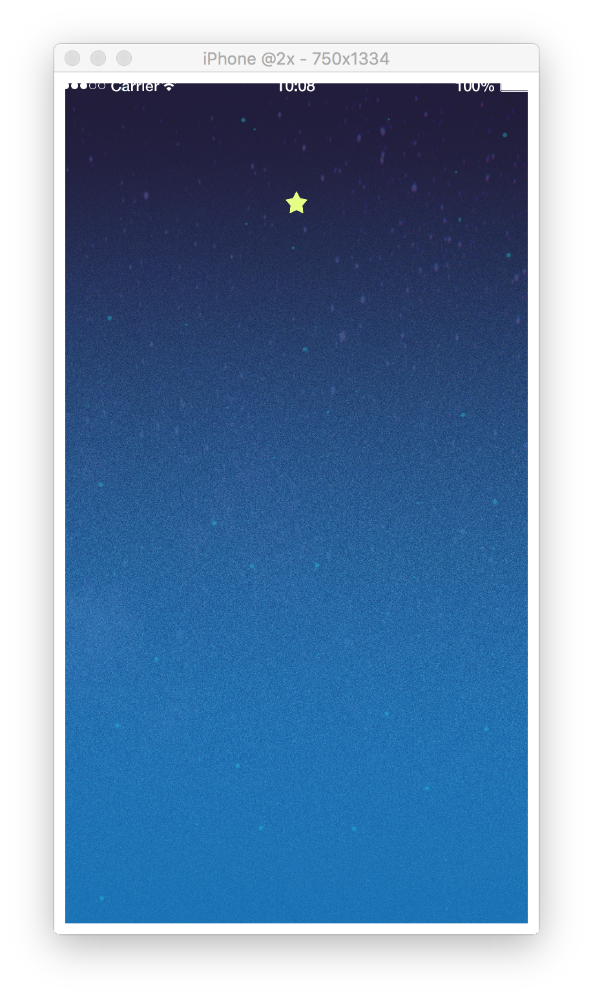

# 5. ボールを動かそう

## ボールを表示しよう
壁と同じようにボールも表示させましょう。  
以下のコードで表示することができます。

```lua
ball = display.newImageRect(displayGroup, "star.png", 50, 50)
ball.tag = "ball"
```

---

## 物理エンジンにボールを追加しよう
表示できたらボールを物理エンジンに追加しましょう。  
以下のコードで物理エンジンに追加されます。  
ボールは自由に動きまわるオブジェクトなので、 `"dynamic"` を指定しましょう。

```lua
physics.addBody(ball, "dynamic", {density = 0.0, friction = 0.0, bounce = 1.0})
```

---

## ボールの位置を初期化する関数を作ろう
物理エンジンに追加できたら、ボールの位置を初期位置に戻す関数 `resetBallPos` を宣言しましょう。
`関数` とは、ひとまとまりのプログラムを名前をつけて保存できるシステムです。これが変数として保存されている場合もあります。
以下のコードで `resetBallPos` 関数を宣言できます。使う際は `resetBallPos()` で使用することができます。

```lua
function resetBallPos()
    ball.x = width/2
    ball.y = 1200
end
```

---

## ボールを初期化してゲームを開始する関数を作ろう
ボールを初期位置に戻し、ボールを動かし始める関数 `gameStart` を宣言しましょう。
また、ソースコードが読まれたタイミングでゲームを起動しておきたいため、 `gameStart()` を書いておきましょう。
以下のコードで `gameStart()` をこのソースコードを読まれたタイミングで実行できます。

```lua
function gameStart()
    resetBallPos()
    ball:setLinearVelocity(0, 500)
end

gameStart()
```

CoronaSDK Reference [setLinearVelocity]
[https://docs.coronalabs.com/api/type/Body/setLinearVelocity.html](https://docs.coronalabs.com/api/type/Body/setLinearVelocity.html)

---

## セクション中の全文
このセクションで書いたコードの全文は以下になります。

```lua
ball = display.newImageRect(displayGroup, "star.png", 50, 50)
ball.tag = "ball"
physics.addBody(ball, "dynamic", {density = 0.0, friction = 0.0, bounce = 1.0})

function resetBallPos()
    ball.x = width/2
    ball.y = 1200
end

function gameStart()
    resetBallPos()
    ball:setLinearVelocity(0, 500)
end

gameStart()
```

画面は以下のようになっていれば成功です。


