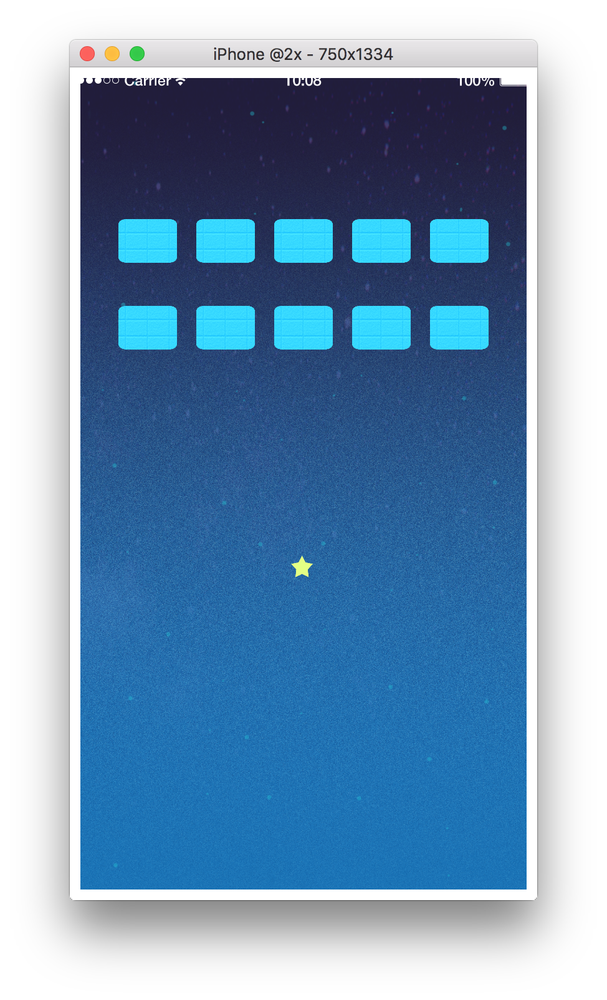

# 6. ブロックを配置してみよう

## 変数のおさらい
ブロックの数を制御するために、  
ブロックをいくつ最初に配置したのか管理する変数 `maxNumBlocks`、  
今ブロックがいくつあるのか管理する変数 `numBlocks` を定義しましょう。  
最初は一つも置いていないので、 `0` を入れておきましょう。  
また、ブロックはたくさんあるので配列で管理します。テーブルを宣言しておきましょう。

```lua
maxNumBlocks = 0
numBlocks = 0

blocks = {}
```

- - -

## ブロックを削除する関数を作ろう
順序が逆になってしまいますが、説明の都合上、作る前に削除する関数を宣言します。  
`index(配列の何番目か)` から、ブロックを削除する関数 `deleteBlock` 、  
配置されているブロックを全て削除する関数 `deleteAllBlocks` を宣言します。

```lua
function deleteBlock(index)
    -- ブロックが存在しない場合は無視する
    if (blocks[index] == nil) then
        -- returnはここで関数を終了させる命令です
        return
    end

    -- removeSelf()は自分を画面から消す関数です
    blocks[index]:removeSelf()
    -- もう表示されていないので空を表す `nil` を入れておきましょう
    blocks[index] = nil
    -- 一つブロックを削除したので、 `numBlocks` を `-1` しておきましょう
    numBlocks = numBlocks - 1
end

function deleteAllBlocks()
    -- for文でブロックを全て削除
    for i = 0, maxNumBlocks, 1 do
        deleteBlock(i)
    end

    -- ブロックを管理している変数を全て初期化する
    maxNumBlocks = 0
    numBlocks = 0
    blocks = {}
end
```

- - -

## ブロックを配置しよう
ブロックを配置する関数 `deployBlocks` を宣言しましょう。  
また、ゲーム開始時にブロックを初期配置しておきたいので、 `deployBlocks()` 読み込み時に実行するように書いておきましょう。

```lua
function deployBlocks()
    -- ブロックを配置する前に全てのブロックを削除
    deleteAllBlocks()

    -- ブロックを配置
    for y = 0, 1, 1 do
        for x = 0, 4, 1 do
            -- 何番目の要素か
            local index = x + (y * 5)
            blocks[index] = display.newImageRect(displayGroup, "block.png", width * 1/8, 100)
            -- (width * 1/6) => 画面を6つに分ける、2つは両端なので、実際に使えるのは4つ
            -- (x + 1) => 分けた4つのうちの何番目か、0は端っこなので+1して無視する
            blocks[index].x = (x + 1) * (width * 1/6)
            -- y=0 => 400, y=1 => 600 となる
            blocks[index].y = 400 + (200 * y)
            blocks[index].tag = "block"
            -- 後で識別しやすいように生成した順番を入れておく
            blocks[index].index = index
            physics.addBody(blocks[index], "static", {density = 0.0, friction = 0.0, bounce = 1.0})

            -- 現在のブロック数を追加
            numBlocks = numBlocks + 1
        end
    end

    -- 生成したブロック数を保存
    maxNumBlocks = numBlocks
end

deployBlocks()
```

- - -

## セクション中の全文
このセクションで書いたコードの全文は以下になります。

```lua
maxNumBlocks = 0
numBlocks = 0

blocks = {}

function deleteBlock(index)
    -- ブロックが存在しない場合は無視する
    if (blocks[index] == nil) then
        -- returnはここで関数を終了させる命令です
        return
    end

    -- removeSelf()は自分を画面から消す関数です
    blocks[index]:removeSelf()
    -- もう表示されていないので空を表す `nil` を入れておきましょう
    blocks[index] = nil
    -- 一つブロックを削除したので、 `numBlocks` を `-1` しておきましょう
    numBlocks = numBlocks - 1
end

function deleteAllBlocks()
    -- for文でブロックを全て削除
    for i = 0, maxNumBlocks, 1 do
        deleteBlock(i)
    end

    -- ブロックを管理している変数を全て初期化する
    maxNumBlocks = 0
    numBlocks = 0
    blocks = {}
end

function deployBlocks()
    -- ブロックを配置する前に全てのブロックを削除
    deleteAllBlocks()

    -- ブロックを配置
    for y = 0, 1, 1 do
        for x = 0, 4, 1 do
            -- 何番目の要素か
            local index = x + (y * 5)
            blocks[index] = display.newImageRect(displayGroup, "block.png", width * 1/8, 100)
            -- (width * 1/6) => 画面を6つに分ける、2つは両端なので、実際に使えるのは4つ
            -- (x + 1) => 分けた4つのうちの何番目か、0は端っこなので+1して無視する
            blocks[index].x = (x + 1) * (width * 1/6)
            -- y=0 => 400, y=1 => 600 となる
            blocks[index].y = 400 + (200 * y)
            blocks[index].tag = "block"
            -- 後で識別しやすいように生成した順番を入れておく
            blocks[index].index = index
            physics.addBody(blocks[index], "static", {density = 0.0, friction = 0.0, bounce = 1.0})

            -- 現在のブロック数を追加
            numBlocks = numBlocks + 1
        end
    end

    -- 生成したブロック数を保存
    maxNumBlocks = numBlocks
end

deployBlocks()
```

画面は以下のようになっていれば成功です。


