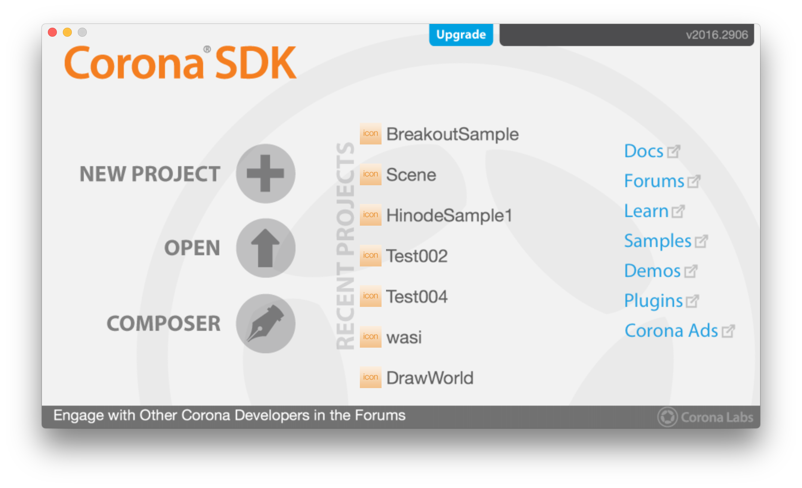
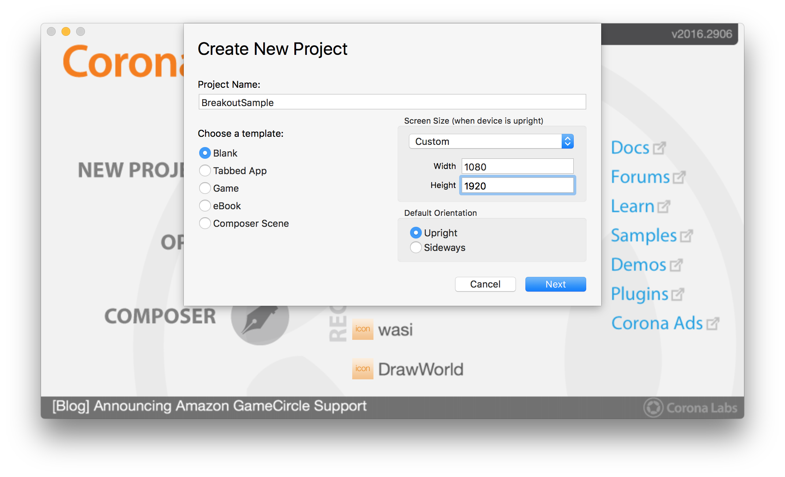
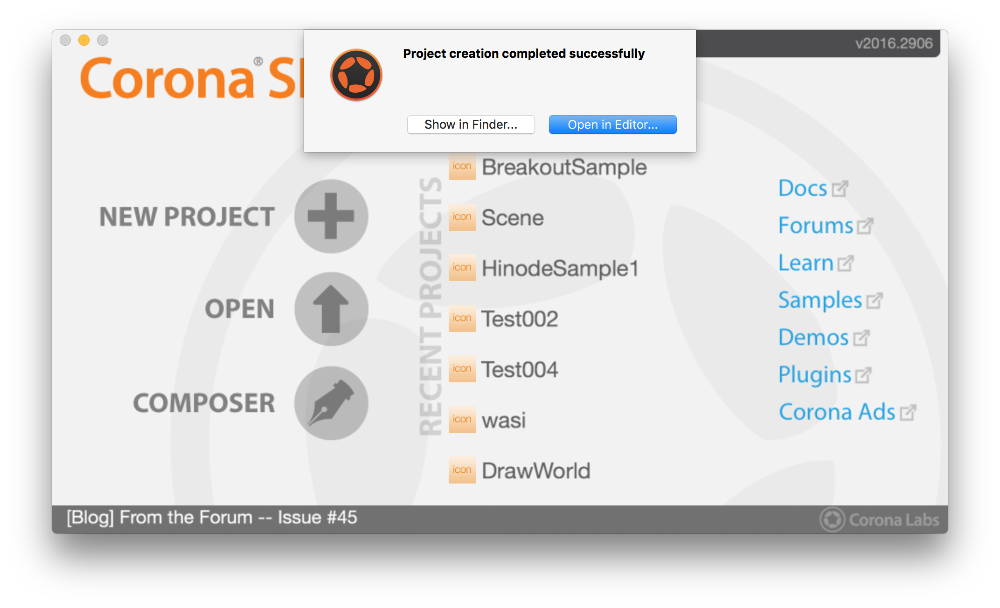
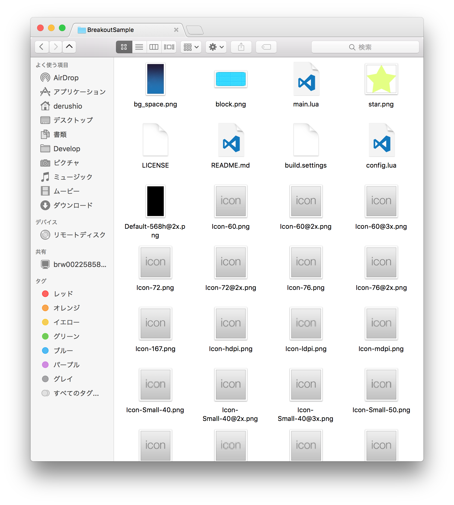
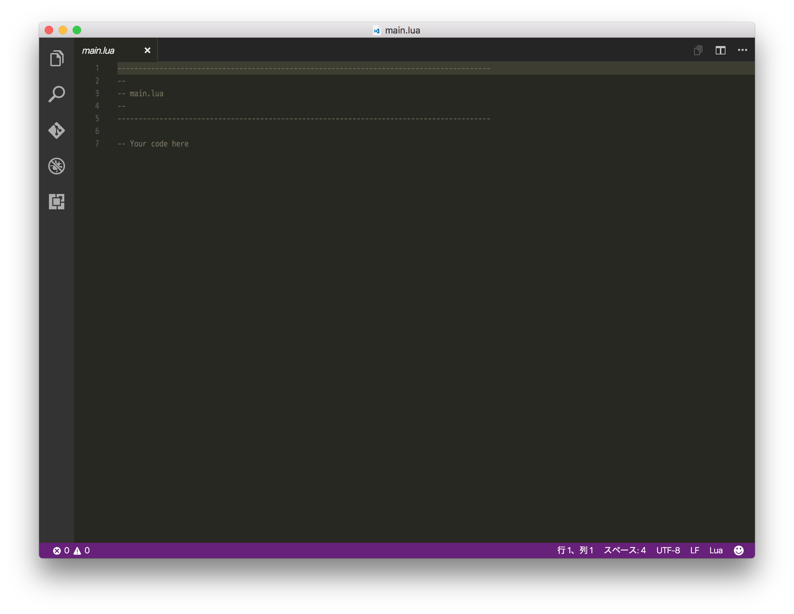
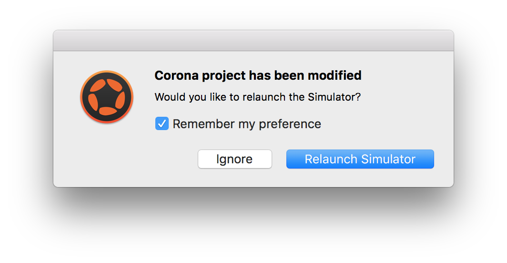

# 1. プロジェクト作成

## プロジェクト作成
NEW PROJECTを選びましょう。

プロジェクト名に `BreakoutSample` と入力し、Widthを1080、Heightを1920に設定しましょう。

OKを押すと `Open in Editor` と `Show in Finder` が表示されるので、`Show in Finder` をし、 `main.lua` をダブルクリックしてエディターで開きましょう。  
このとき表示されるフォルダーは閉じないでおくと後が楽です。

- - -

## 画像ファイルを配置しよう
プロジェクトの中に使う画像ファイルを配置しましょう。  
今回必要なファイルは[こちら](http://itnav.jp/derushio/BootCamp/bootcamp-image.zip)からダウンロードできます。  
  
ダウンロードできたファイルを展開して、中身をプロジェクトのフォルダーにコピーしてください。
以下のようなファイル構成になっていればOKです。

- - -

## プロジェクト作成後
エディターを開くと以下のような画面が表示されます。  
この画面の中の `-- Your code here` の末尾から改行してコードを書き始めます。  
この `--` はコメントアウトといって、この行はコードではないことを表します。
アプリは、英文での命令を順番に書くことで作ることができます。  
これからこのテキストエディタに命令(コード)をたくさん書いていきます。

このダイアログがでたらチェックボックスにチェックをいれて `relaunch simulator` してください。

- - -

## セクション中の全文
このセクションではコードを書きません。