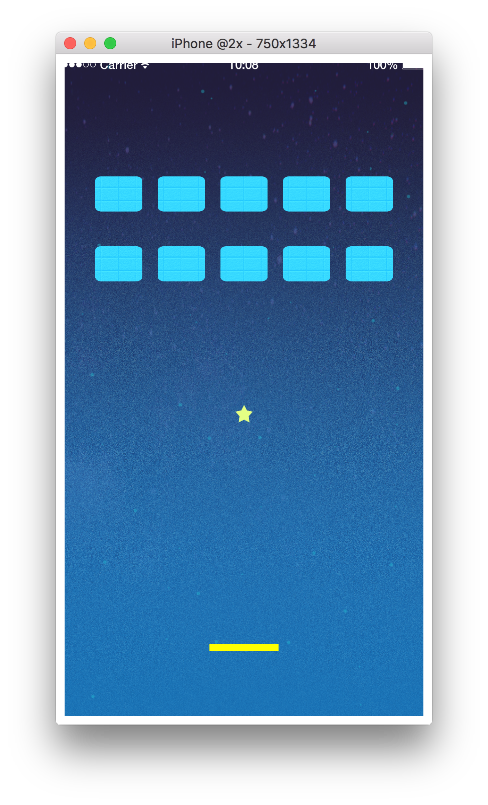

# 7. ラケットを配置しよう

## ラケットを配置
今までと同じようにラケットを配置します。  
`racket:setFillColor(1.0, 1.0, 0.0)` でラケットの色を設定しています。  
カッコの中は `setFillColor(赤の色の濃さ, 緑の色の濃さ, 青の色の濃さ)` となっております。全ての濃さは `0.0 ~ 1.0` の範囲の少数で表されます。  
他にも便利な関数や機能があり、[API Sample](./../apiSample/index.md)にまとめてあるので余裕のあるときに読んでみてください。

```lua
racket = display.newRect(displayGroup, width/2, 1700, 200, 20)
racket.tag = "racket"
racket:setFillColor(1.0, 1.0, 0.0)
physics.addBody(racket, "static", {density = 0.0, friction = 0.0, bounce = 1.0})
```

参考
CoronaSDK Reference[setFillColor]

[https://docs.coronalabs.com/api/type/ShapeObject/setFillColor](https://docs.coronalabs.com/api/type/ShapeObject/setFillColor.html)

---

## セクション中の全文
このセクションで書いたコードの全文は以下になります。

```lua
racket = display.newRect(displayGroup, width/2, 1700, 200, 20)
racket.tag = "racket"
racket:setFillColor(1.0, 1.0, 0.0)
physics.addBody(racket, "static", {density = 0.0, friction = 0.0, bounce = 1.0})
```

画面は以下のようになっていれば成功です。


