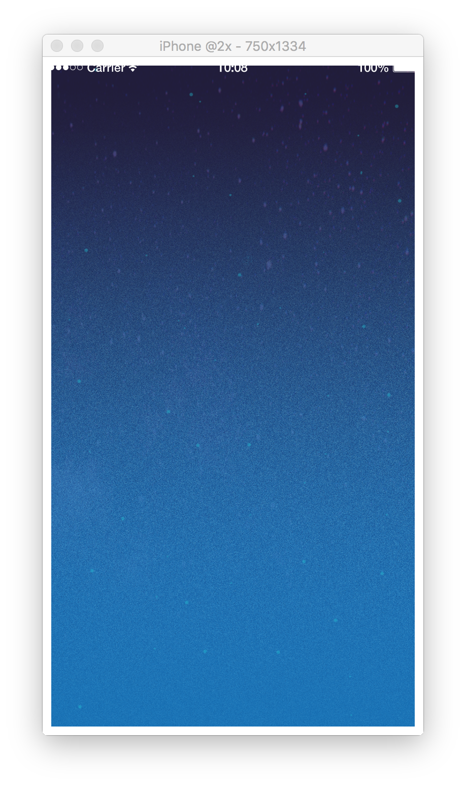

# 4. Create walls

## Draw background image
You can draw the background by this code.

```lua
-- 背景黒では寂しいので、背景を追加しましょう
background = display.newImageRect(displayGroup, "bg_space.png", width, height)
background.x = width/2
background.y = height/2
```

from：CoronaSDK Reference [newImageRect]

[https://docs.coronalabs.com/api/library/display/newImageRect
](https://docs.coronalabs.com/api/library/display/newImageRect.html)

---

## Draw walls
Let's create walls so the moving ball will bounce inside of the display.<br />
Walls should have 4 sides. You can create each of them by using `display.newLine(LeftTop's X coordinate, LeftTop's Y coordinate, RightBottom's X coordinate, RightBottom's Y coordinate)`<br />
<br />
However, 4 walls created like<br />
`walls1 = display.newLine(displayGroup, 0, 0, width, 0)`<br />
`walls2 = display.newLine(displayGroup, 0, 0, 0, height)`<br />
...<br />
doesn't look neat.<br />
<br />
So, let's try using a table system.<br />
Table is defined `walls = {}`, and you can access variable by `walls[0]`, `walls[1]`.<br />
Also, variable value should be defined as `tag`. It will make it easier for you to recognize which wall by tagging them.<br />

```lua
以下のコードを書き、壁を描画してみましょう。 
-- 壁の連想配列を作ろう
walls = {}
walls[1] = display.newLine(displayGroup, 0, 0, width, 0)
walls[1].tag = "topWall"

walls[2] = display.newLine(displayGroup, 0, 0, 0, height)
walls[2].tag = "leftWall"

walls[3] = display.newLine(displayGroup, width, 0, width, height)
walls[3].tag = "rightWall"

walls[4] = display.newLine(displayGroup, 0, height, width, height)
walls[4].tag = "bottomWall"
```

from<br />
CoronaSDK Reference [newLine]

[https://docs.coronalabs.com/api/library/display/newLine](https://docs.coronalabs.com/api/library/display/newLine.html)

---

## Setting the walls in a lump by using `for statement`
You can batch process an array by using `for statement`.
`for statement` is written `for i = initial value, last value, How many i are added each time do ~ end`.
Each time the i value get's added up towords the last value, inside of `do ~ end` will be continuously executed. It will stop when it hits the last value.
Let's create walls by `for statement`.
  
By using `physics.addBody(what you are registering, type, option)` you can register to the physics system. The types are "static" objects that don't move, and "dynamic" objects that do move. Objects moves with "kinematic" as well, but since objects moves along gravity with "dynamic", objects moves without relation to gravity with "kinematic".
以下のコードを入力してみましょう。

```lua
-- for i = 最初の値, 最後の値(含む), 幾つづつiをプラスするか do ~ end
-- `#` は要素数
for i = 1, #walls, 1 do
    -- 壁の厚さを変更
    walls[i].strokeWidth = 50
    -- `physics.addBody(登録する物, 種類, オプション)` 物理演算に登録
    physics.addBody(walls[i], "static", {density = 0.0, friction = 0.0, bounce = 1.0})
end
```

参考
CoronaSDK Reference[addBody]

[https://docs.coronalabs.com/api/library/physics/addBody](https://docs.coronalabs.com/api/library/physics/addBody.html)

---

## All code in this chapter
All code in this chapter

```lua
-----------------------------------------------------------------------------------------
--
-- ピンボールゲームを作ってみよう
-- main.lua
--
-----------------------------------------------------------------------------------------


-- ############################## 変数とは？ ##############################

-- `width` は画面の横幅(1080)が入っている
width = display.contentWidth
-- `height` は画面の縦幅(1920)が入っている
height = display.contentHeight

-- 描画グループ
displayGroup = display.newGroup()

-- ############################## 変数とは？ ##############################


-- ############################## 物理演算とは？ ##############################

-- 物理演算をするための機能を読み込んで `physics` に入れておく
physics = require("physics")
-- 物理演算を起動する
physics.start(true)
physics.setGravity(0, 0)

-- ############################## 物理演算とは？ ##############################


-- ############################## 壁を作ろう ##############################

-- 背景黒では寂しいので、背景を追加しましょう
background = display.newImageRect(displayGroup, "bg_space.png", width, height)
background.x = width/2
background.y = height/2

-- 壁の連想配列を作ろう
walls = {}
walls[1] = display.newLine(displayGroup, 0, 0, width, 0)
walls[1].tag = "topWall"

walls[2] = display.newLine(displayGroup, 0, 0, 0, height)
walls[2].tag = "leftWall"

walls[3] = display.newLine(displayGroup, width, 0, width, height)
walls[3].tag = "rightWall"

walls[4] = display.newLine(displayGroup, 0, height, width, height)
walls[4].tag = "bottomWall"

-- for i = 最初の値, 最後の値(含む), 幾つづつiをプラスするか do ~ end
-- `#` は要素数
for i = 1, #walls, 1 do
    -- 壁の厚さを変更
    walls[i].strokeWidth = 50
    -- `physics.addBody(登録する物, 種類, オプション)` 物理演算に登録
    physics.addBody(walls[i], "static", {density = 0.0, friction = 0.0, bounce = 1.0})
end

-- ############################## 壁を作ろう ##############################


```
Your successful if the display shows like the following image.


