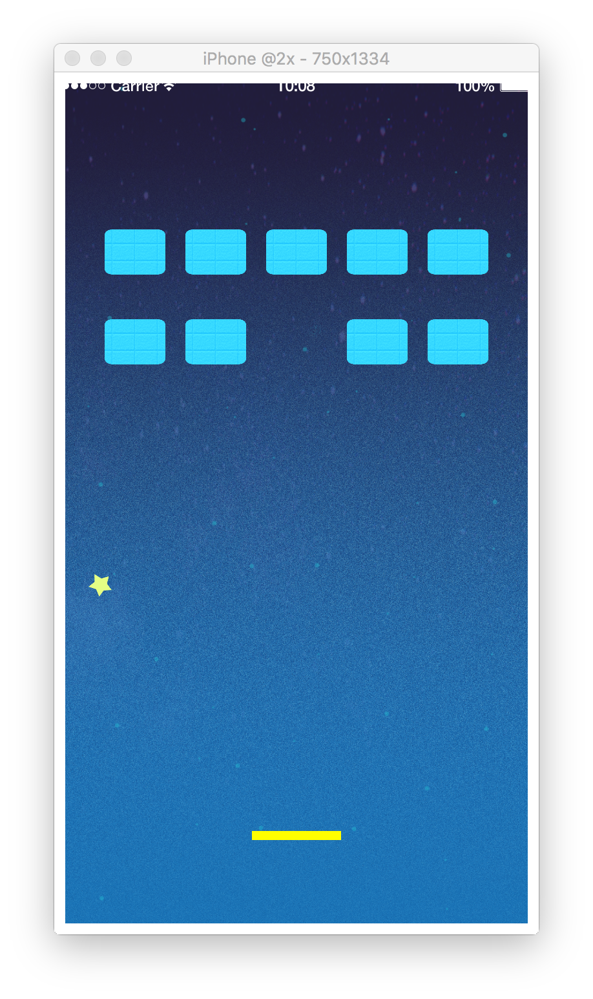

# 10. ゲームロジックを作ろう

## ボールの挙動を安定させよう
現在のプログラムだと、ボールが壁に跳ねるものの、少々怪しい動きをしている。  
これが良いとされる場合もあるが、今回は敢えて挙動を安定させよう。  
`ballStabilization` という関数を宣言し、この関数が実行されたタイミングでこのボールが向かっている方向への速度を安定化し、ついでにボールを回転させてみよう。

```lua
function ballStabilization()
    -- 速度を取得して、x,yの速度を500に固定する
    local vx, vy = ball:getLinearVelocity()
        
    if (0 < vx) then
        vx = 500
    else
        vx = -500
    end

    if (0 < vy) then
        vy = 500
    else
        vy = -500
    end
    
    -- 速度を安定させる
    ball:setLinearVelocity(vx, vy)
    -- 回転させる
    ball:applyTorque(90)
end
```

参考
CoronaSDK Reference[setLinearVelocity]
[https://docs.coronalabs.com/api/type/Body/setLinearVelocity](https://docs.coronalabs.com/api/type/Body/setLinearVelocity.html)

CoronaSDK Reference[applyTorque]
[https://docs.coronalabs.com/api/type/Body/applyTorque](https://docs.coronalabs.com/api/type/Body/applyTorque.html)

---

## ボールの当たり判定を追加しよう
ブロック崩しなので、ボールがブロックに当たった場合はブロックを消し、全て消した場合はクリアとしなければならない。  
また、下の壁に当たった場合はゲームオーバーとしなければならない。  
ボールが当たった後はボールの挙動が乱れるので、 `ballStabilization` も実行しておこう。  
以上のことをするためのロジックは既に実装済みなので、実際にコーディングしてみると以下のようになる。

```lua
function ballCollision(event)
    if (event.phase == "began") then
        print("collision: "..event.other.tag)
    elseif (event.phase == "ended") then
        ballStabilization()

        -- ブロックに当たった時はブロックを削除
        if (event.other.tag == "block") then
            local hitBlock = event.other
            deleteBlock(hitBlock.index)
            -- ブロックがなくなった場合はクリア判定
            if (numBlocks == 0) then
                completeGame()
            end
        elseif (event.other.tag == "bottomWall") then
            failGame()
        end
    end
end

-- 衝突イベントをボールに設定
ball:addEventListener("collision", ballCollision)
```

---

## セクション中の全文
このセクションで書いたコードの全文は以下になります。

```lua
function ballStabilization()
    -- 速度を取得して、x,yの速度を500に固定する
    local vx, vy = ball:getLinearVelocity()
        
    if (0 < vx) then
        vx = 500
    else
        vx = -500
    end

    if (0 < vy) then
        vy = 500
    else
        vy = -500
    end
    
    -- 速度を安定させる
    ball:setLinearVelocity(vx, vy)
    -- 回転させる
    ball:applyTorque(90)
end

function ballCollision(event)
    if (event.phase == "began") then
        print("collision: "..event.other.tag)
    elseif (event.phase == "ended") then
        ballStabilization()

        -- ブロックに当たった時はブロックを削除
        if (event.other.tag == "block") then
            local hitBlock = event.other
            deleteBlock(hitBlock.index)
            -- ブロックがなくなった場合はクリア判定
            if (numBlocks == 0) then
                completeGame()
            end
        elseif (event.other.tag == "bottomWall") then
            failGame()
        end
    end
end

-- 衝突イベントをボールに設定
ball:addEventListener("collision", ballCollision)
```

画面は以下のようになっていれば成功です。  
ボールがしっかりバウンドと回転をするようになり、ブロックも消えるようになります。  
ゲームクリアやゲームオーバーも表示されるようになり、だいぶゲームらしくなりました。


