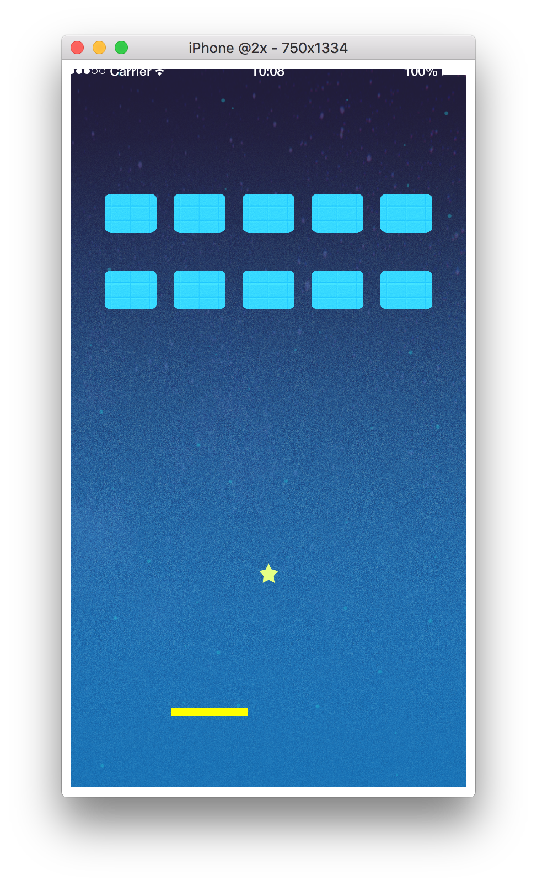

# 8. Let's try moving the racket

## Make a function to move the racket
Let's make a function `moveRacket` to move the racket.  
Let's create a function that will only move on the x axis, since if the racket can move on the y axis freely it does not hold as a Breakout.
There is not much need to make it into a function if it is this level of processing, but the racket movement may be extended, so let's make it as a function just in case.

```lua
function moveRacket(xPosition)
    racket.x = xPosition
end
```

---

## Set touch event
This time we will make the racket move with a touch event.
Declare the function `displayTouchListener` to receive the touch event.  
By registering this function with `Runtime:addEventListener("touch" displayTouchListener)` ,`Runtime` is the entire screen, so `displayTouchListener` will be called at the moment you touch somewhere on the screen. 
Also, the case of the `"touch"` event, it will be called `At the start of touch` `At the start of swipe` `At the end of touch`.
So basically during you are touching the screen, if your finger coordinate moves `displayTouchListener` will be called.
You can get the coordinate you touched by `event.x, event.y`.

```lua
function displayTouchListener(event)
   moveRacket(event.x) 
end

-- Set touch event of whole screen
Runtime:addEventListener("touch", displayTouchListener)
```

Reference
CoronaSDK Reference[addEventListener]

[https://docs.coronalabs.com/api/type/EventDispatcher/addEventListener](https://docs.coronalabs.com/api/type/EventDispatcher/addEventListener.html)


---

## All code in this chapter
All code in this chapter

```lua
-----------------------------------------------------------------------------------------
--
-- Let's make Breakout
-- main.lua
--
-----------------------------------------------------------------------------------------


-- ############################## What is variable？ ##############################

-- `width` contains the width(1080) of the display
width = display.contentWidth
-- `height` contains the height(1920) of the display
height = display.contentHeight

-- display group(necassary to draw the display with coronaSDK)
displayGroup = display.newGroup()

-- ############################## What is variable？ ##############################


-- ############################## physics is ... ##############################

-- Load the function to use the physics engine and put it in `physics` .
physics = require("physics")
-- Activate physics engine
physics.start(true)
physics.setGravity(0, 0)

-- ############################## physics is ... ##############################


-- ############################## Create walls ##############################

-- A black color background is lonesome, so let's add a image to the background
background = display.newImageRect(displayGroup, "bg_space.png", width, height)
background.x = width/2
background.y = height/2

-- Let's create an associative array of walls
walls = {}
walls[1] = display.newLine(displayGroup, 0, 0, width, 0)
walls[1].tag = "topWall"

walls[2] = display.newLine(displayGroup, 0, 0, 0, height)
walls[2].tag = "leftWall"

walls[3] = display.newLine(displayGroup, width, 0, width, height)
walls[3].tag = "rightWall"

walls[4] = display.newLine(displayGroup, 0, height, width, height)
walls[4].tag = "bottomWall"

-- for i = initial value, end value(is included), How many i are added each time do ~ end
-- `#` is the number of elements
for i = 1, #walls, 1 do
    -- Change the wall thickness
    walls[i].strokeWidth = 50
    -- `physics.addBody(what you are registering, type, option)` Register to the  physics system
    physics.addBody(walls[i], "static", {density = 0.0, friction = 0.0, bounce = 1.0})
end

-- ############################## Create walls ##############################


-- ############################## Let's try moving the ball ##############################

ball = display.newImageRect(displayGroup, "star.png", 50, 50)
ball.tag = "ball"
physics.addBody(ball, "dynamic", {density = 0.0, friction = 0.0, bounce = 1.0})

function resetBallPos()
    ball.x = width/2
    ball.y = 1200
end

function gameStart()
    resetBallPos()
    ball:setLinearVelocity(0, 500)
end

gameStart()

-- ############################## Let's try moving the ball ##############################


-- ############################## Let's deploy blocks ##############################

maxNumBlocks = 0
numBlocks = 0

blocks = {}

function deleteBlock(index)
    -- Ignore when there are no blocks
    if (blocks[index] == nil) then
        -- return is an command to stop the function here
        return
    end

    -- removeSelf() is a function to delete itself from the screen
    blocks[index]:removeSelf()
    -- Since it is not displayed anymore, assign nil which means empty
    blocks[index] = nil
    -- We deleted one block, so let's set `numBlocks` to `-1` .
    numBlocks = numBlocks - 1
end

function deleteAllBlocks()
    -- Delete all blocks using for statement
    for i = 0, maxNumBlocks, 1 do
        deleteBlock(i)
    end

    -- Initialize all variables managing the blocks
    maxNumBlocks = 0
    numBlocks = 0
    blocks = {}
end

function deployBlocks()
    -- Delete all blocks before deploying blocks
    deleteAllBlocks()

    -- Deploy blocks
    for y = 0, 1, 1 do
        for x = 0, 4, 1 do
            -- Which element
            local index = x + (y * 5)
            blocks[index] = display.newImageRect(displayGroup,
                "block.png", width * 1/8, 100)
            -- (width * 1/6) => Divide the screen into six , since two are both ends, four can actually be used
            -- (x + 1) => Which one of the four you divided . 0 is the edge of the screen , so +1 and ignore it
            blocks[index].x = (x + 1) * (width * 1/6)
            -- It will be y=0 => 400, y=1 => 600 
            blocks[index].y = 400 + (200 * y)
            blocks[index].tag = "block"
            -- Include the generated order for easy identification later on
            blocks[index].index = index
            physics.addBody(blocks[index], "static", 
                {density = 0.0, friction = 0.0, bounce = 1.0})

            -- Add the current number of blocks
            numBlocks = numBlocks + 1
        end
    end

    -- Add the current number of blocks
    maxNumBlocks = numBlocks
end

deployBlocks()

-- ############################## Let's deploy blocks ##############################


-- ############################## Let's arrange the racket ##############################

racket = display.newRect(displayGroup, width/2, 1700, 200, 20)
racket.tag = "racket"
racket:setFillColor(1.0, 1.0, 0.0)
physics.addBody(racket, "static", {density = 0.0, friction = 0.0, bounce = 1.0})

-- ############################## Let's arrange the racket ##############################


-- ############################## Let's try moving the racket ##############################

function moveRacket(xPosition)
    racket.x = xPosition
end

function displayTouchListener(event)
   moveRacket(event.x) 
end

-- Set touch event of the whole screen
Runtime:addEventListener("touch", displayTouchListener)

-- ############################## Let's try moving the racket ##############################


```
It's a success if the display looks like the following image. 
The racket will move.


