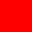
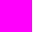
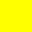
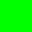
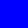

SetFillColorで使えるRGBの色一覧表です。

| 色 | コード |
| --- | --- |
|  | RGB\(0, 0, 0\) |
|  | RGB(128, 128, 128) |
|  | RGB(255, 255, 255) |
| | RGB(255, 0, 0) |
| | RGB(255, 0, 255) |
| | RGB(255, 102, 0) |
| | RGB(255, 255, 0) |
| | RGB(0, 255, 0) |
| | RGB(0, 128, 0) |
| | RGB(0, 255, 255) |
| | RGB(0, 0, 255) |
| | RGB(128, 0, 128) |

