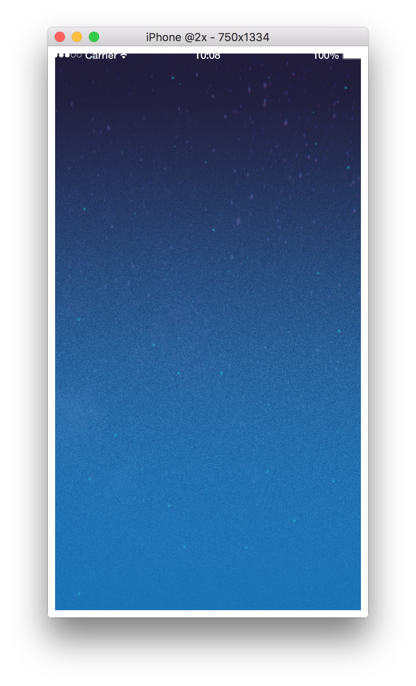

# 2. What's variable

## 'variable' is ...

Programing language has system of 'variable'.<br />
'variable' can store numbers and objects and more.<br />
<br />
Lua language for example,<br />
`number = 10`<br />
This means `number` stored 10.<br />
<br />
lua language has static 'variable' for environment.<br />
They are `display.contentWidth` and `display.contentHeight` and more.<br />
<br />
But, they are too long spell and you maybe use many times.<br />
Too long spell is hassle.<br />
You can use short spell variable for environment variable.<br />
<br />
If you use own variable, You can write `width = display.contentWidth`.<br />
Write `=` at center, variable at left, variable or objects at right.<br />
Try write this code, will be `width` stored `content width` and `height` stored `content height`.<br />

```lua
-- `width` は画面の横幅(1080)が入っている
width = display.contentWidth
-- `height` は画面の縦幅(1920)が入っている
height = display.contentHeight
```

It's written, must save code. used windows -> `ctrl + s`, mac -> `Command + s`.<br />
If errors weren't not found , it is successful.<br />

---

## Create display group

Create display group for draw view on CoronaSDK, and store displayGroup.<br />
try this code.<br />

```lua
-- 描画グループ
displayGroup = display.newGroup()
```

from<br />
CoronaSDK Reference [displayGroup]<br />

[https://docs.coronalabs.com/api/library/display/newGroup](https://docs.coronalabs.com/api/library/display/newGroup.html)

---

## All code in this chapter

All code in this chapter

```lua
-----------------------------------------------------------------------------------------
--
-- ピンボールゲームを作ってみよう
-- main.lua
--
-----------------------------------------------------------------------------------------


-- ############################## 変数とは？ ##############################

-- `width` は画面の横幅(1080)が入っている
width = display.contentWidth
-- `height` は画面の縦幅(1920)が入っている
height = display.contentHeight

-- 描画グループ
displayGroup = display.newGroup()

-- ############################## 変数とは？ ##############################


```

display is like this pic.<br />



