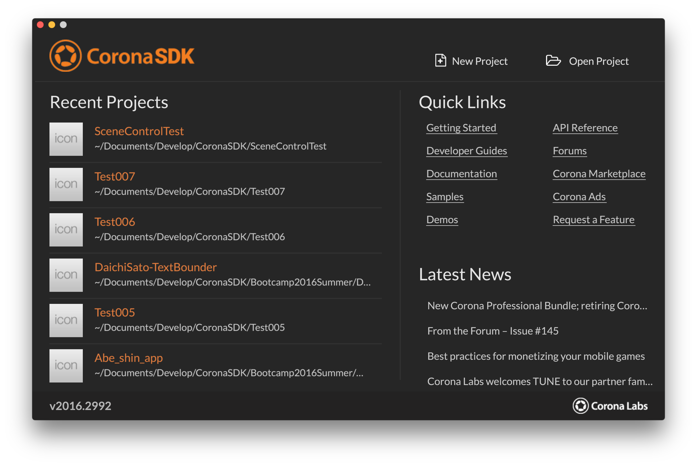
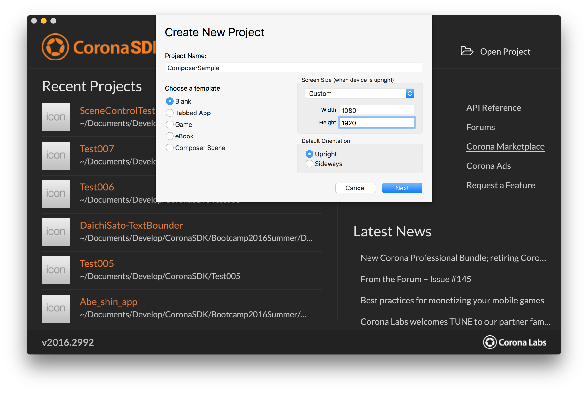
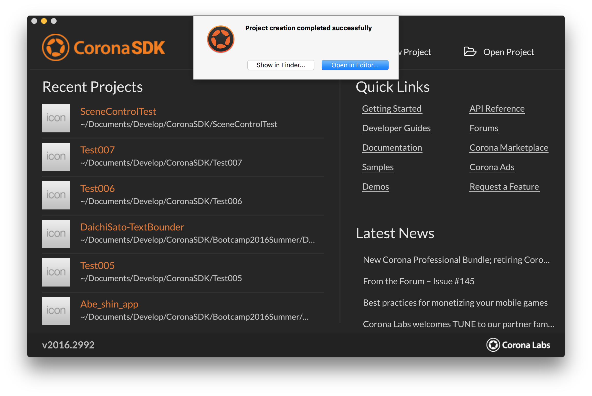

# 1.プロジェクト作成

## プロジェクト作成
NEW PROJECTを選びましょう。



プロジェクト名に `ComposerSample` と入力し、Widthを1080、Heightを1920に設定しましょう。



OKを押すと `Open in Editor` と `Show in Finder` が表示されるので、`Show in Finder` をし、 `main.lua` をダブルクリックしてエディターで開きましょう。  
このとき表示されるフォルダーは閉じないでおくと後が楽です。



- - -

## プロジェクト作成後
エディターを開くと以下のような画面が表示されます。  
この画面の中の `-- Your code here` の末尾から改行してコードを書き始めます。  
アプリは、英文での命令を順番に書くことで作ることができます。  
これからこのテキストエディタに命令(コード)をたくさん書いていきます。


- - -

## セクション中の全文

```lua
-----------------------------------------------------------------------------------------
--
-- main.lua
--
-----------------------------------------------------------------------------------------

-- Your code here
```